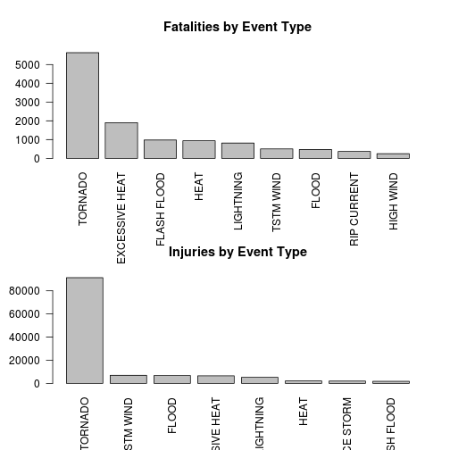
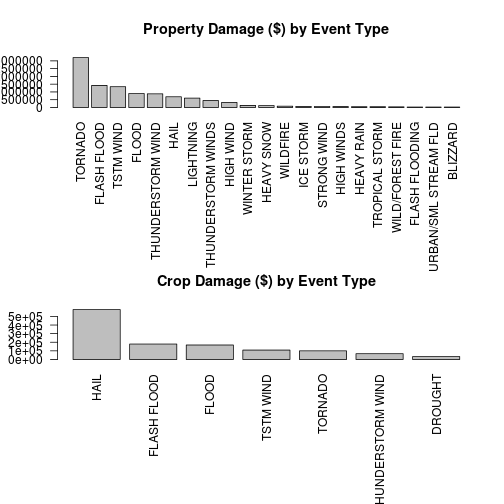

# An Analysis of the Impact of Storms in the US

## Synopsis

In this analysis, we import data from the NOAA and aggregate by event (storm) type to show the most signifcant:
* Population health impacts, and
* Economic impacts

TO do this, we load the bzip file into a dataframe, then aggregate the "EVTYPE" by fields "FATALITIES" and "INJURIES" for population health, and by "CROPDMG" and "PROPDMG" for economic impacts.

We're interested in the most impactful events, as such we use the top 5% of the data.  While it may seem arbitrary, the graphical analysis shown below becomse unwieldy at lower thresholds.  The reproducer may change this value as required to fit their needs.

Each aggregate data set is plotted in a panel in one of two plots (two panels each for population and economic impacts.)


## Data Processing

We load the data into R directly from the bzip file, caching the result to save time.


```r
data = read.csv(bzfile("repdata-data-StormData.csv.bz2"))
```

Sanity check of data:


```r
head(data)
```

```
##   STATE__           BGN_DATE BGN_TIME TIME_ZONE COUNTY COUNTYNAME STATE
## 1       1  4/18/1950 0:00:00     0130       CST     97     MOBILE    AL
## 2       1  4/18/1950 0:00:00     0145       CST      3    BALDWIN    AL
## 3       1  2/20/1951 0:00:00     1600       CST     57    FAYETTE    AL
## 4       1   6/8/1951 0:00:00     0900       CST     89    MADISON    AL
## 5       1 11/15/1951 0:00:00     1500       CST     43    CULLMAN    AL
## 6       1 11/15/1951 0:00:00     2000       CST     77 LAUDERDALE    AL
##    EVTYPE BGN_RANGE BGN_AZI BGN_LOCATI END_DATE END_TIME COUNTY_END
## 1 TORNADO         0                                               0
## 2 TORNADO         0                                               0
## 3 TORNADO         0                                               0
## 4 TORNADO         0                                               0
## 5 TORNADO         0                                               0
## 6 TORNADO         0                                               0
##   COUNTYENDN END_RANGE END_AZI END_LOCATI LENGTH WIDTH F MAG FATALITIES
## 1         NA         0                      14.0   100 3   0          0
## 2         NA         0                       2.0   150 2   0          0
## 3         NA         0                       0.1   123 2   0          0
## 4         NA         0                       0.0   100 2   0          0
## 5         NA         0                       0.0   150 2   0          0
## 6         NA         0                       1.5   177 2   0          0
##   INJURIES PROPDMG PROPDMGEXP CROPDMG CROPDMGEXP WFO STATEOFFIC ZONENAMES
## 1       15    25.0          K       0                                    
## 2        0     2.5          K       0                                    
## 3        2    25.0          K       0                                    
## 4        2     2.5          K       0                                    
## 5        2     2.5          K       0                                    
## 6        6     2.5          K       0                                    
##   LATITUDE LONGITUDE LATITUDE_E LONGITUDE_ REMARKS REFNUM
## 1     3040      8812       3051       8806              1
## 2     3042      8755          0          0              2
## 3     3340      8742          0          0              3
## 4     3458      8626          0          0              4
## 5     3412      8642          0          0              5
## 6     3450      8748          0          0              6
```

Aggregating event types by poulation health dimensions

```r
evimpact.fatalities <- aggregate(data$FATALITIES ~ data$EVTYPE, FUN=sum)
evimpact.injuries <- aggregate(data$INJURIES ~ data$EVTYPE, FUN=sum)
```

Aggregating event types by economic impacts


```r
evimpact.prop <- aggregate(data$PROPDMG ~ data$EVTYPE, FUN=sum)
evimpact.crop <- aggregate(data$CROPDMG ~ data$EVTYPE, FUN=sum)
```

Stripping out 0 values and finding the top 5%, then choosing only values above this "quantile", and then sorting in reverse order


```r
evimpact.fatalities <- evimpact.fatalities[!evimpact.fatalities[,2] == 0, ]
evimpact.fatalities.quantile <- quantile(evimpact.fatalities[,2], 0.95)
evimpact.fatalities <- evimpact.fatalities[evimpact.fatalities[,2] > evimpact.fatalities.quantile, ]
evimpact.fatalities <- evimpact.fatalities[ order(-evimpact.fatalities[,2], evimpact.fatalities[,1]), ]

evimpact.injuries <- evimpact.injuries[!evimpact.injuries[,2] == 0, ]
evimpact.injuries.quantile <- quantile(evimpact.injuries[,2], 0.95)
evimpact.injuries <- evimpact.injuries[evimpact.injuries[,2] > evimpact.injuries.quantile, ]
evimpact.injuries <- evimpact.injuries[ order(-evimpact.injuries[,2], evimpact.injuries[,1]), ]

evimpact.crop <- evimpact.crop[!evimpact.crop[,2] == 0, ]
evimpact.crop.quantile <- quantile(evimpact.crop[,2], 0.95)
evimpact.crop <- evimpact.crop[evimpact.crop[,2] > evimpact.crop.quantile, ]
evimpact.crop <- evimpact.crop[ order(-evimpact.crop[,2], evimpact.crop[,1]), ]

evimpact.prop <- evimpact.prop[!evimpact.prop[,2] == 0, ]
evimpact.prop.quantile <- quantile(evimpact.prop[,2], 0.95)
evimpact.prop <- evimpact.prop[evimpact.prop[,2] > evimpact.prop.quantile, ]
evimpact.prop <- evimpact.prop[ order(-evimpact.prop[,2], evimpact.prop[,1]), ]
```


## Results

First we plot the population health impacts.


```r
par(mfrow = c(2, 1))
barplot(names.arg=evimpact.fatalities[,1], height=evimpact.fatalities[,2], cex.names=1, las=2, main="Fatalities by Event Type")
barplot(names.arg=evimpact.injuries[,1], height=evimpact.injuries[,2], cex.names=1, las=2, main="Injuries by Event Type")
```

 

Next we plot the economic impact.


```r
par(mfrow = c(2, 1), mar=c(10, 4, 4, 2))
barplot(names.arg=evimpact.prop[,1], height=evimpact.prop[,2], cex.names=1, las=2, main="Property Damage ($) by Event Type")
barplot(names.arg=evimpact.crop[,1], height=evimpact.crop[,2], cex.names=1, las=2, main="Crop Damage ($) by Event Type")
```

 

It seems that Tornados are, by far, the most impactful events when it comes to human health, and contribute significantly to property damage as well.
